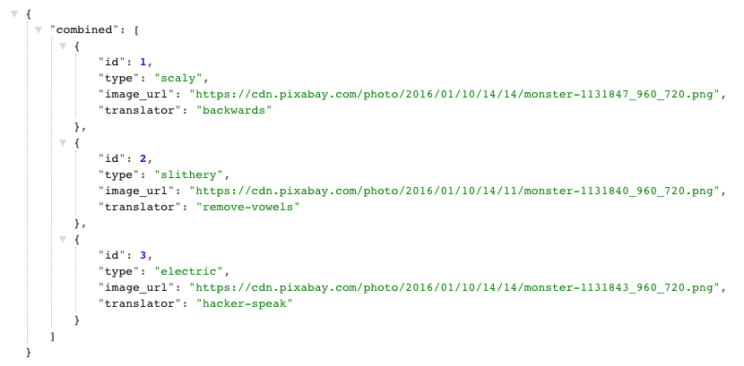

## Monsters - backend

The Monsters app takes in a negative thought or fear and gives it a personality. When your monster says your thought back to you, it's easy to see that monsters can't always be trusted.

[Deployed backend](https://damp-headland-17256.herokuapp.com/combined)

#### Galvanize Web App

Backend for "Galvanize Web App" project: https://github.com/amberjohnsonsmile/galvanize-web-app

For this project, you will build a light application that reads and writes data, has unit tests for functions, and integrates with an API. The topic is up to you, so pick a project that speaks to your interests.

#### Back-end

Build an API that reads and writes data.

* You should have at least 2 collections of items. For example, if you make a school app, you should at a minimum have something like `students` and `classes`.
* You need to write some data transformation that combines the two objects. For example, combine classes and students together into one data structure.
* Your data transformations should have unit tests
* Deploy your back-end 
